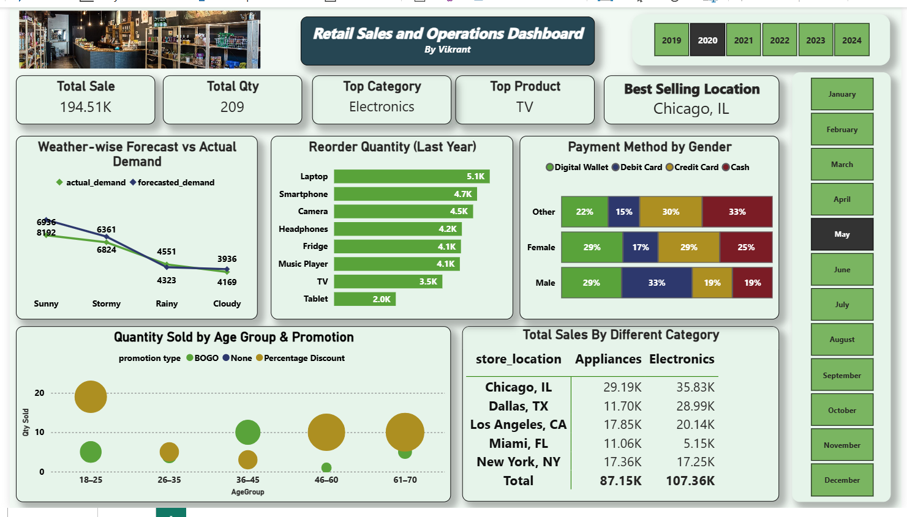

# 🛒 Retail Sales and Operations Dashboard

This Power BI dashboard provides a comprehensive view of sales operations across product categories, customer segments, payment preferences, and store locations. It is designed to help retail managers and business stakeholders make informed decisions based on data-driven insights.

---

## 📊 Dashboard Highlights

- ✅ **Total Sales & Quantity** KPIs
- 📍 **Top Selling Location**
- 📦 **Reorder Quantity** by Product (Bar Chart)
- 💳 **Payment Method by Gender** (Stacked Bar)
- 🌦️ **Weather-wise Forecast vs Actual Demand** (Line Chart)
- 🧑‍🤝‍🧑 **Quantity by Age Group & Promotion** (Bubble Chart)
- 🏪 **Sales by Store Location & Category**

---

## 📸 Dashboard Preview

📄 [Click here to download the Dashboard Explanation (PDF)](./retail_and_operation.pdf)

---

## 🧠 Key Insights

- **Demand vs Forecast**: Analyze how weather impacts actual vs expected demand.
- **Customer Segments**: Understand how different age groups and genders respond to promotions and payment types.
- **Top Locations**: Identify best performing store locations for specific product categories.
- **Inventory Planning**: Plan reorder quantities based on past year’s performance.

---

## 🛠 Tools Used

- **Power BI**
- DAX (Data Analysis Expressions)
- Custom Visuals
- Data Modeling

---

## 📂 Files Included

- `RetailSalesDashboard.pbix` - Power BI file
- `dashboard-image.png` - Dashboard screenshot
- `README.md` - Project description

---

## 🔗 Connect with Me

Created by **Vikrant**  
📧 Email: [your-email@example.com]  
📍 Location: India

---

> “Retail success depends on data you can see, not just guess. Make your dashboard your retail radar.” 🚀

